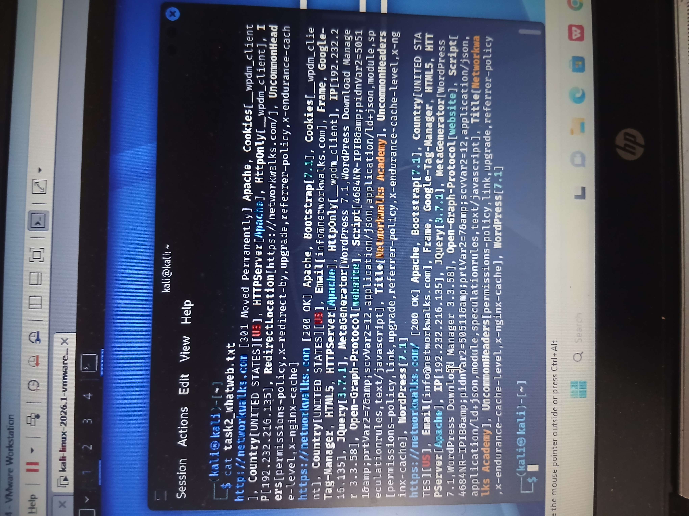

# Task 02 – Website Technology Fingerprinting with WhatWeb

## Objective

The objective of this task was to fingerprint the technologies running on the target website using WhatWeb. This reconnaissance technique helps identify the web server, content management system (CMS), frameworks, JavaScript libraries, IP address, and other technologies exposed by a web application.

## Target

**Domain:** networkwalks.com

## Tool Used

- WhatWeb
- Kali Linux

## Command

```bash
whatweb networkwalks.com
```

## Findings

The WhatWeb scan successfully identified several technologies and configuration details associated with the target website.

### Key Findings

- **Web Server:** Apache
- **CMS:** WordPress 7.1
- **Front-end Framework:** Bootstrap 7.1
- **JavaScript Library:** jQuery 3.7.1
- **IP Address:** 192.232.216.135
- **Country:** United States
- **HTTP Response:** 301 Moved Permanently followed by 200 OK
- **Website Title:** Networkwalks Academy
- **Email Identified:** info@networkwalks.com
- **Google Tag Manager:** Detected
- **HTML5:** Detected
- **Open Graph Protocol:** Detected

## Analysis

The results show that the website is running on an Apache web server and uses WordPress as its content management system.

WhatWeb also identified technologies such as Bootstrap and jQuery, providing additional information about the website's technology stack.

The initial HTTP request returned a **301 Moved Permanently** response, redirecting the request to the HTTPS version of the website, which subsequently returned a **200 OK** response.

Technology fingerprinting is useful during reconnaissance because it allows security analysts to understand the technologies exposed by a target before conducting further authorized security assessments.

## Security Relevance

From a cybersecurity perspective, identifying technologies can help security professionals:

- Build an inventory of externally exposed technologies.
- Identify potentially outdated software.
- Research known vulnerabilities associated with detected technologies.
- Understand the target's web application architecture.
- Prioritize areas for further authorized security assessment.

A detected technology does **not automatically mean that the website is vulnerable**. Further validation would be required before reaching any security conclusion.

## Evidence

The screenshot below shows the WhatWeb scan performed from Kali Linux.



## Skills Demonstrated

- Web reconnaissance
- Technology fingerprinting
- Kali Linux
- WhatWeb
- Web technology analysis
- OSINT
- Security documentation

## Conclusion

The WhatWeb reconnaissance successfully revealed useful information about the technologies used by the target website, including its web server, CMS, JavaScript libraries, framework, IP address, and other web components.

This demonstrates how technology fingerprinting can support the reconnaissance phase of a cybersecurity assessment.

## Disclaimer

This lab was conducted for educational and authorized cybersecurity training purposes. The techniques demonstrated here should only be used against systems for which proper authorization has been obtained.
