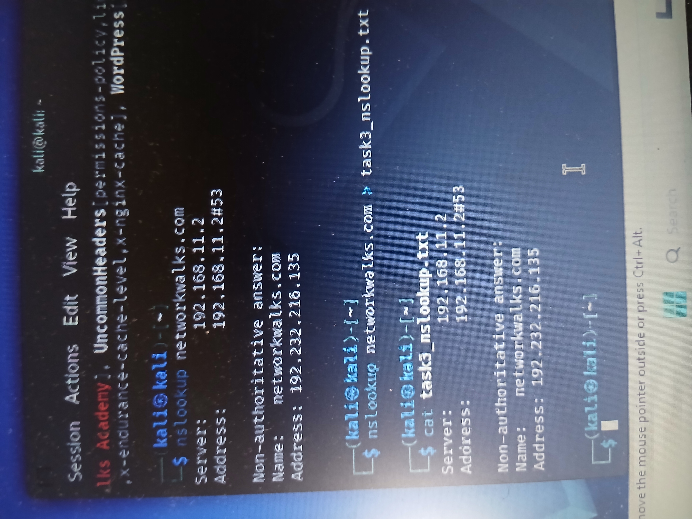

# Task 03 – DNS Resolution with NSLookup

## Objective

The objective of this task was to resolve the target domain name to its associated IP address using the Domain Name System (DNS). This demonstrates how DNS reconnaissance can be used to identify the network address associated with a public domain.

---

## Target

**Domain:** `networkwalks.com`

---

## Tool Used

- Kali Linux
- NSLookup
- Domain Name System (DNS)
- Terminal

---

## Command Executed

The following command was executed in Kali Linux:

```bash
nslookup networkwalks.com
```

---

## Methodology

The `nslookup` utility was used to query DNS information for the target domain.

When the command was executed, the DNS resolver attempted to translate the human-readable domain name:

```text
networkwalks.com
```

into its corresponding IP address.

The command provides information such as:

- DNS server used for the query
- DNS server address
- Target domain name
- Resolved IP address
- Type of DNS response

The terminal output was also saved to a text file using:

```bash
nslookup networkwalks.com > task3_nslookup.txt
```

The saved output was verified with:

```bash
cat task3_nslookup.txt
```

---

## Findings

The DNS lookup successfully resolved the domain:

```text
networkwalks.com
```

to its associated IP address.

The query returned a **non-authoritative answer**, meaning the DNS server that responded was not necessarily the authoritative name server for the domain but was able to provide the requested DNS information.

The exact IP address identified during the assessment is preserved in the screenshot and terminal output collected as evidence.

> **Note:** DNS records and IP addresses can change over time. Therefore, the evidence collected during the lab represents the DNS configuration observed at the time the task was performed.

---

## Analysis

DNS resolution is an important part of the reconnaissance phase of a cybersecurity assessment.

Websites are normally accessed using human-readable domain names such as:

```text
networkwalks.com
```

However, network communication ultimately relies on IP addresses.

By performing a DNS lookup, a security analyst or authorized penetration tester can determine which IP address is associated with a particular domain.

This information can contribute to understanding the externally visible infrastructure associated with an authorized assessment target.

---

## Security Relevance

DNS information is useful during legitimate cybersecurity reconnaissance because it can help security professionals:

- Resolve domain names to IP addresses
- Identify public-facing infrastructure
- Verify DNS configurations
- Assist with asset discovery
- Understand externally accessible systems
- Map domains to network infrastructure
- Support further authorized security assessment activities

From a defensive perspective, organizations should regularly review their public DNS records to ensure that outdated or unnecessary records do not expose information about systems that should no longer be publicly accessible.

---

## Evidence

The screenshot below shows the `nslookup` command executed against `networkwalks.com` and the DNS resolution result obtained during the lab.



### Raw Output

The terminal output was also saved as:

```text
task3_nslookup.txt
```

This provides additional evidence of the DNS query performed during the assessment.

---

## Skills Demonstrated

This task demonstrates practical experience with:

- DNS reconnaissance
- Domain name resolution
- NSLookup
- Kali Linux
- Linux command-line operations
- Network reconnaissance
- Information gathering
- Evidence collection
- Security analysis
- Cybersecurity documentation

---

## Key Takeaway

This exercise demonstrated that DNS can provide useful information about the public infrastructure associated with a domain.

Using `nslookup`, the domain name was successfully translated into its corresponding IP address, demonstrating one of the fundamental information-gathering techniques used during authorized cybersecurity reconnaissance.

---

## Conclusion

Task 03 successfully demonstrated DNS resolution using the `nslookup` utility in Kali Linux.

The target domain was queried, its associated IP address was identified, and the results were documented and preserved as evidence.

The exercise strengthened practical understanding of DNS, network reconnaissance, command-line tools, and professional cybersecurity documentation.

---

## Disclaimer

This lab was conducted strictly for educational and authorized cybersecurity training purposes.

All reconnaissance and information-gathering techniques demonstrated in this repository should only be performed against systems for which explicit authorization has been obtained.
