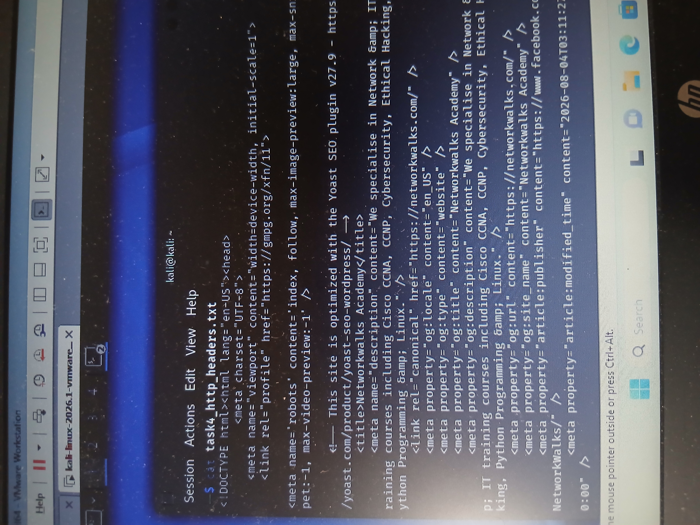

# Task 04 – HTTP Response Header Analysis

## Objective

The objective of this task was to inspect the HTTP response headers returned by the target website using `curl`.

HTTP response headers can provide useful information about a web application's server, content type, caching configuration, security policies, cookies, and other technologies.

---

## Target

**Domain:** `networkwalks.com`

**URL:** `https://networkwalks.com`

---

## Environment & Tool Used

- Kali Linux
- cURL
- Linux Terminal
- HTTP/HTTPS

---

## Command Executed

The HTTP response headers were retrieved using:

```bash
curl -I https://networkwalks.com
```

The results were saved for documentation using:

```bash
curl -sS -D task4_http_headers.txt -o /dev/null https://networkwalks.com
```

The saved results were reviewed using:

```bash
cat task4_http_headers.txt
```

---

## Findings

The HTTP header analysis returned a successful response from the target website.

### Key Findings

- **HTTP Protocol:** HTTP/2
- **Status Code:** 200 OK
- **Reported Web Server:** Apache
- **Content Type:** `text/html; charset=UTF-8`
- **WordPress REST API:** `/wp-json/` reference observed
- **WordPress-related caching:** Observed through an `X-Nginx-Cache` header

Additional response headers relating to cookies, caching, permissions, and other web-server configuration information were also observed during the assessment.

---

## Analysis

The `200 OK` status code indicates that the web server successfully processed the HTTP request.

The `Server` response header reported Apache, providing information about the web-server technology exposed by the application.

WordPress-related information was also visible in the response headers, including a reference to the WordPress REST API.

HTTP response-header analysis is useful during reconnaissance because headers may reveal information about the technologies and configuration of a web application.

---

## Security Relevance

HTTP response headers can help security professionals understand how a web application is configured.

During an authorized security assessment, header analysis may help identify:

- Web-server technologies
- Application frameworks and CMS indicators
- Caching configuration
- Cookie configuration
- Redirect behavior
- Content types
- Security-related HTTP headers
- Unnecessary technology disclosure

Exposing technology information does not automatically represent a vulnerability. Findings must be analyzed and validated before determining whether they introduce security risk.

---

## Evidence

The screenshot below shows the HTTP response-header analysis performed from Kali Linux.



### Raw Output

The complete response-header output was also saved as:

```text
task4_http_headers.txt
```

---

## Skills Demonstrated

- HTTP/HTTPS analysis
- HTTP response-header inspection
- cURL
- Kali Linux
- Web reconnaissance
- Command-line operations
- Security analysis
- Evidence collection
- Cybersecurity documentation

---

## Key Takeaway

This exercise demonstrated how HTTP response headers can reveal useful information about a public-facing web application.

Using `curl`, I was able to inspect the server's response and identify information relating to the HTTP status, server technology, content type, and WordPress-related infrastructure.

---

## Conclusion

Task 04 successfully demonstrated HTTP response-header analysis using cURL in Kali Linux.

The exercise strengthened practical understanding of HTTP communication, web reconnaissance, server-response analysis, and professional security documentation.

---

## Disclaimer

This lab was conducted strictly for educational and authorized cybersecurity training purposes.

All reconnaissance and security-testing techniques demonstrated in this repository should only be performed against systems for which explicit authorization has been obtained.
