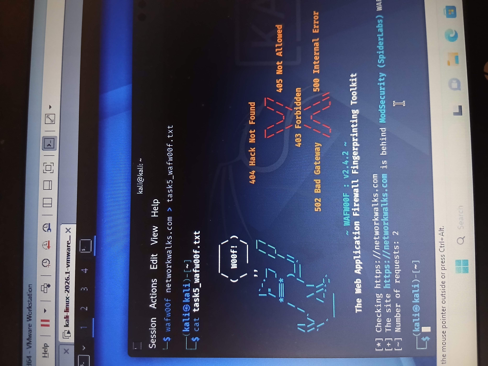

# Task 05 – Web Application Firewall Detection with WAFW00F

## Objective

The objective of this task was to determine whether the target website was protected by a Web Application Firewall (WAF) and, where possible, identify the WAF technology in use.

A Web Application Firewall helps protect web applications by monitoring and filtering HTTP/HTTPS traffic between users and the web application.

---

## Target

**Domain:** `networkwalks.com`

**URL:** `https://networkwalks.com`

---

## Environment & Tool Used

- Kali Linux
- WAFW00F
- Linux Terminal
- HTTP/HTTPS

---

## Command Executed

The following command was executed from Kali Linux:

```bash
wafw00f networkwalks.com
```

The scan output was also saved to a text file using:

```bash
wafw00f networkwalks.com > task5_wafw00f.txt
```

The saved output was reviewed using:

```bash
cat task5_wafw00f.txt
```

---

## Findings

WAFW00F successfully detected a Web Application Firewall protecting the target website.

### Key Findings

- **Target:** `https://networkwalks.com`
- **WAF Detected:** Yes
- **WAF Technology:** ModSecurity
- **Vendor/Identification:** SpiderLabs
- **WAFW00F Version Used:** 2.4.2
- **Requests Made During Detection:** 2

The tool reported:

```text
The site https://networkwalks.com is behind ModSecurity (SpiderLabs) WAF.
```

---

## Analysis

The WAFW00F fingerprinting process indicated that the target website was protected by **ModSecurity**, an application-layer Web Application Firewall.

A WAF sits between web clients and the application and can inspect incoming HTTP/HTTPS requests. Depending on its configuration, it can detect or block traffic associated with malicious web activity.

The identification of a WAF is useful during authorized reconnaissance because it provides information about defensive technologies deployed in front of a web application.

The presence of ModSecurity does not by itself indicate that the website is secure or vulnerable. The effectiveness of a WAF depends on factors such as its configuration, rulesets, maintenance, and the security of the underlying application.

---

## Security Relevance

Web Application Firewalls are commonly used as an additional security layer for public-facing web applications.

They may help defend against web-based attacks such as:

- SQL injection attempts
- Cross-site scripting (XSS)
- Malicious HTTP requests
- Known attack patterns
- Automated scanning and exploitation attempts
- Other suspicious application-layer traffic

From a cybersecurity assessment perspective, WAF fingerprinting can help security professionals understand the defensive controls protecting an authorized target.

Defenders can also use this information to verify that expected security controls are properly deployed and externally visible.

---

## Evidence

The screenshot below shows the WAFW00F scan performed from Kali Linux and the detection of ModSecurity.



### Raw Output

The complete terminal output was also saved as:

```text
task5_wafw00f.txt
```

---

## Skills Demonstrated

This task demonstrates practical experience with:

- Web Application Firewall detection
- WAF fingerprinting
- WAFW00F
- ModSecurity
- Kali Linux
- Web reconnaissance
- Security-control identification
- Command-line operations
- Evidence collection
- Cybersecurity documentation

---

## Key Takeaway

This exercise demonstrated how publicly observable web behavior can be analyzed to identify defensive technologies protecting a web application.

Using WAFW00F, the assessment identified **ModSecurity (SpiderLabs)** as the WAF protecting the designated target.

---

## Conclusion

Task 05 successfully demonstrated Web Application Firewall detection and fingerprinting using WAFW00F.

The exercise provided practical experience identifying a defensive security control, interpreting WAF fingerprinting results, preserving evidence, and documenting reconnaissance findings professionally.

---

## Disclaimer

This lab was conducted strictly for educational and authorized cybersecurity training purposes.

All reconnaissance and security-testing techniques demonstrated in this repository should only be performed against systems for which explicit authorization has been obtained.
