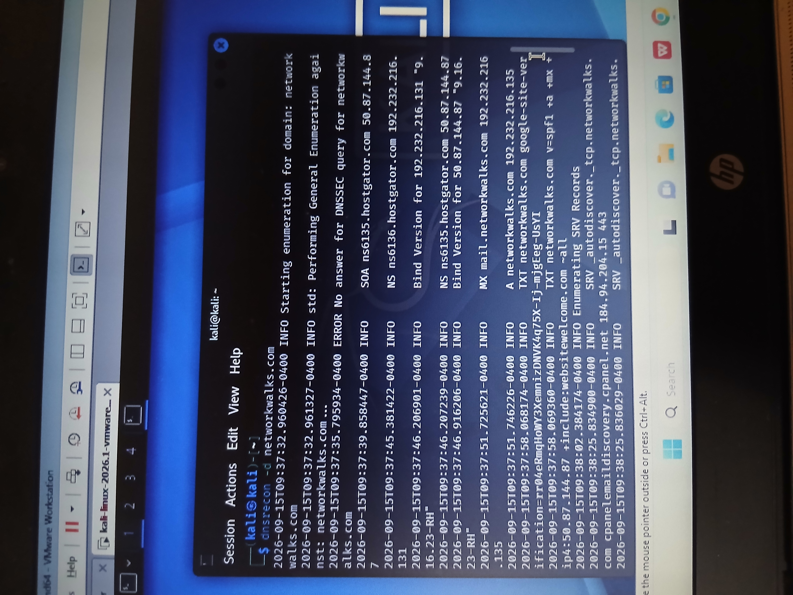

# Task 06 – DNS Record Enumeration with DNSRecon

## Objective

The objective of this task was to enumerate publicly available DNS records associated with the target domain using DNSRecon.

DNS enumeration helps security professionals understand the publicly exposed DNS infrastructure of an organization, including name servers, mail servers, IP addresses, TXT records, and service records.

---

## Target

**Domain:** `networkwalks.com`

---

## Environment & Tool Used

- Kali Linux
- DNSRecon
- Linux Terminal
- Domain Name System (DNS)

---

## Command Executed

The following command was executed:

```bash
dnsrecon -d networkwalks.com
```

The results can also be saved to a text file using:

```bash
dnsrecon -d networkwalks.com > task6_dnsrecon.txt
```

The saved output can be reviewed using:

```bash
cat task6_dnsrecon.txt
```

---

## Findings

DNSRecon successfully enumerated multiple DNS records associated with `networkwalks.com`.

### Name Server Records

The assessment identified HostGator name servers, including:

```text
ns6135.hostgator.com
ns6136.hostgator.com
```

### A Record

The domain resolved to:

```text
192.232.216.135
```

### Mail Server Record

An MX record associated with the domain was identified:

```text
mail.networkwalks.com
```

### TXT Records

TXT records were identified, including:

- A Google site-verification record
- An SPF-related record used for email sender authorization

### SOA Record

A Start of Authority (SOA) record was identified, providing information relating to the authoritative DNS infrastructure for the domain.

### SRV Records

DNSRecon also enumerated SRV records associated with services configured for the domain, including service-discovery information.

---

## Analysis

The DNS enumeration provided a broader view of the target's publicly accessible DNS infrastructure than a basic domain-to-IP lookup.

While Task 03 demonstrated how a domain can be resolved to an IP address, this task expanded the reconnaissance process by examining several different DNS record types.

The identified records revealed information relating to:

- Authoritative DNS infrastructure
- Public IP addressing
- Mail infrastructure
- Email security configuration
- Domain verification
- Publicly advertised services

This demonstrates why DNS enumeration is an important component of authorized reconnaissance and external attack-surface assessment.

---

## Security Relevance

DNS records are designed to expose information necessary for Internet services to operate, but they can also provide useful infrastructure information during security assessments.

Security professionals can use DNS enumeration to:

- Discover public-facing infrastructure
- Identify mail servers
- Identify authoritative name servers
- Review SPF and other TXT records
- Discover publicly advertised services
- Map domains to IP addresses
- Support external asset discovery
- Identify potential DNS misconfigurations

The presence of a DNS record does not itself indicate a vulnerability. Findings should be evaluated in context before determining whether they represent a security risk.

---

## Evidence

The screenshot below shows DNSRecon enumerating DNS records associated with the target domain.



### Raw Output

The terminal results were also saved as:

```text
task6_dnsrecon.txt
```

---

## Skills Demonstrated

This task demonstrates practical experience with:

- DNS enumeration
- DNSRecon
- DNS record analysis
- A records
- MX records
- NS records
- TXT/SPF records
- SOA records
- SRV records
- Kali Linux
- Network reconnaissance
- Attack-surface discovery
- Evidence collection
- Cybersecurity documentation

---

## Key Takeaway

This exercise demonstrated how DNS enumeration can provide a detailed picture of an organization's publicly exposed DNS infrastructure.

DNSRecon was able to identify several types of DNS records associated with the target, providing useful information for an authorized reconnaissance assessment.

---

## Conclusion

Task 06 successfully demonstrated DNS record enumeration using DNSRecon in Kali Linux.

The exercise provided practical experience identifying and interpreting DNS records, understanding publicly exposed infrastructure, collecting evidence, and documenting reconnaissance findings professionally.

---

## Disclaimer

This lab was conducted strictly for educational and authorized cybersecurity training purposes.

All reconnaissance and security-testing techniques demonstrated in this repository should only be performed against systems for which explicit authorization has been obtained.
